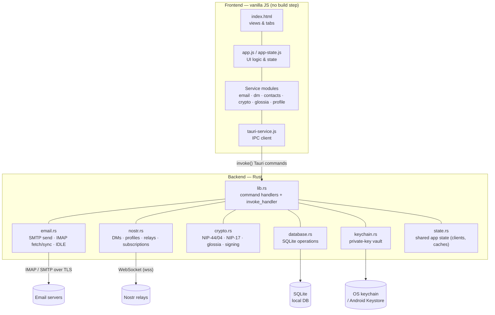

# Architecture

## System Overview

nostr-mail is a Tauri application: a vanilla-JavaScript frontend talks to a Rust
backend over Tauri's IPC bridge, and the backend owns all I/O — email transport,
Nostr relays, the OS keychain, and the local SQLite database. The frontend never
touches the network or secrets directly; every privileged operation is a Tauri
command.



## Project Structure

```
tauri-app/
├── frontend/                  # Frontend assets (vanilla JS, no build step)
│   ├── index.html             # Main HTML file (all views/tabs)
│   ├── storage-service.js     # Persistence helpers
│   ├── js/                    # JavaScript modules
│   │   ├── app.js             # Main application logic
│   │   ├── app-state.js       # State management
│   │   ├── email-service.js   # Email functionality
│   │   ├── dm-service.js      # Direct messages
│   │   ├── contacts-service.js# Contact management
│   │   ├── crypto-service.js  # Frontend crypto helpers
│   │   ├── glossia-service.js # Glossia encode/decode
│   │   ├── database-service.js# DB command wrappers
│   │   ├── profile-manager.js # Profile editing
│   │   ├── notification-service.js
│   │   ├── tauri-service.js   # Backend communication
│   │   ├── dom-manager.js     # DOM utilities
│   │   └── utils.js
│   └── styles/                # CSS files (one per concern)
│       ├── variables.css
│       ├── email.css
│       ├── contacts.css
│       ├── dm.css
│       └── ...
├── backend/                   # Rust backend
│   ├── src/
│   │   ├── main.rs            # Thin entry point (calls lib::run)
│   │   ├── lib.rs            # Tauri command definitions + invoke_handler
│   │   ├── email.rs          # SMTP send / IMAP fetch / sync
│   │   ├── nostr.rs          # Nostr protocol (DMs, profiles, relays)
│   │   ├── crypto.rs         # Encryption/decryption (NIP-44/04, glossia)
│   │   ├── database.rs       # SQLite operations
│   │   ├── keychain.rs       # OS-keychain key vault (multi-account)
│   │   ├── storage.rs        # Storage abstractions
│   │   ├── state.rs          # Shared app state
│   │   ├── types.rs          # Shared type definitions
│   │   ├── nostr_mail_capnp.rs # Generated Cap'n Proto bindings
│   │   └── schema/nostr_mail.capnp
│   └── Cargo.toml            # Rust dependencies
└── backend/tauri.conf.json    # Tauri configuration
```

> **Note**: Tauri commands are defined and registered in `lib.rs` (via `tauri::generate_handler!`), not in `main.rs`. `main.rs` is a thin shim that calls into the library.

## Data Flow

**1. Frontend** (JavaScript) handles UI and user interactions

**2. Tauri Service** bridges frontend and backend via Tauri commands

**3. Backend** (Rust) handles:

   - Email operations (SMTP/IMAP, folder sync, threading)
   - Nostr operations (DMs, profiles, relays, live subscriptions)
   - Encryption/decryption (NIP-44/NIP-04, NIP-17 gift wrap, glossia encoding)
   - Database operations (SQLite)

**4. Database** stores:

   - Contacts and profiles
   - Email messages
   - DM conversations
   - Settings and preferences

## Key Technologies

- **Tauri**: Cross-platform framework wrapping Rust backend with web frontend
- **nostr-sdk**: Rust library for Nostr protocol implementation
- **lettre**: Rust email library for SMTP/IMAP
- **rusqlite**: SQLite database for local storage
- **NIP-44**: Modern encryption standard for Nostr messages

## Frontend Architecture

### Module Structure

- **app-state.js**: Centralized state management
- **dom-manager.js**: DOM element management utilities
- **tauri-service.js**: Backend communication layer
- **email-service.js**: Email-specific functionality
- **dm-service.js**: Direct message functionality
- **contacts-service.js**: Contact management
- **notification-service.js**: User feedback system
- **utils.js**: Common utility functions

### State Management

The application uses a centralized state management system (`appState`) that tracks:

- Contacts
- Direct messages
- Email messages
- Settings
- Keypair
- Relays
- Selection state

## Backend Architecture

### Core Modules

- **main.rs**: Thin entry point that calls `lib::run`
- **lib.rs**: Tauri command definitions and the `invoke_handler` registration
- **email.rs**: SMTP sending, IMAP fetching, and folder sync
- **nostr.rs**: Nostr protocol operations (DMs, profiles, relays)
- **crypto.rs**: Encryption/decryption operations (NIP-44/NIP-04, glossia)
- **database.rs**: SQLite database operations
- **keychain.rs**: OS-keychain private-key vault (multi-account support)
- **storage.rs**: Storage abstractions
- **state.rs**: Shared application state (relay clients, caches)
- **types.rs**: Shared type definitions

### Database Schema

The SQLite database stores:

- Contacts (profiles, metadata)
- Email messages (encrypted content, metadata)
- DM conversations (encrypted messages, metadata)
- Settings (per-pubkey configuration)
- Relay configurations

## Security Considerations

- **Private keys are stored in the OS secure keychain**, not in `localStorage` or the database. Desktop uses the native keychain via the `keyring` crate (macOS Keychain, Windows Credential Manager, Linux Secret Service); Android uses a Jetpack Security `EncryptedFile` with its master key in the Android Keystore. See [Accounts & Keys](pages/accounts.md).
- All keys live in a single encrypted vault entry, cached in memory for the session so the OS prompts at most once per launch.
- **Multi-account is supported**: keys are keyed by public key, and per-account data (contacts, settings, emails, DMs) is stored against the active public key. Switching accounts does not delete the previous key.
- Older builds that kept keys in `localStorage` are migrated into the keychain automatically on first launch, after which the plaintext copies are removed.
- Encryption/decryption happens in the Rust backend.
- The SQLite database is local; the OS provides at-rest protection at the filesystem level.
- All network communications use TLS/SSL.
- NIP-44 encryption provides modern security guarantees; NIP-17 gift wrapping additionally hides DM metadata from relays.
- App passwords are encrypted at rest via the user's private key.