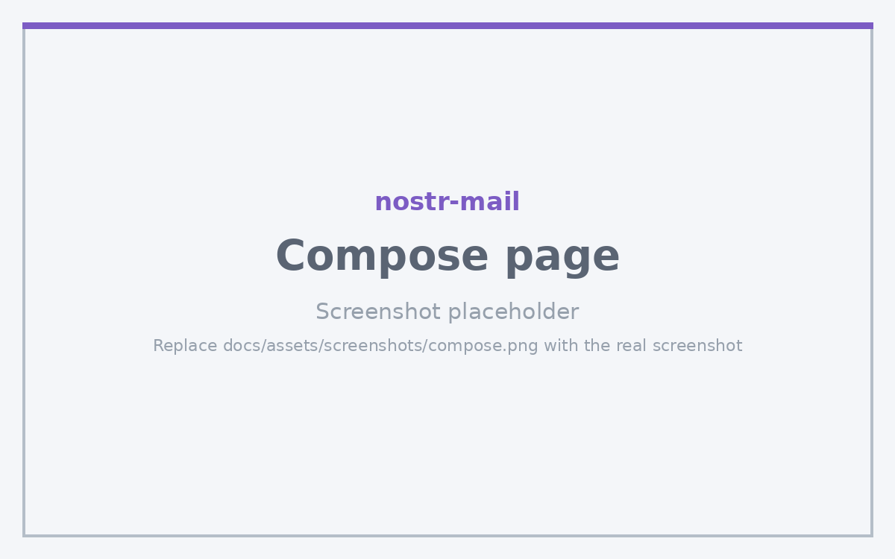

# Compose Page

The Compose page is where you create and send encrypted emails.

## Purpose

Compose and send encrypted emails to recipients, with optional Nostr direct message notifications.

## Key Features

- **Recipient Selection**: Choose from Nostr contacts with email addresses or enter any email address manually
- **Email Composition**: Write subject and message body
- **Encryption**: Encrypt email content using NIP-44 (default) or NIP-04
- **Signing**: Sign emails with your Nostr private key for authentication
- **Attachments**: Add file attachments with automatic hybrid encryption (AES-256 for files, NIP-44 for keys)
- **Draft Saving**: Save drafts locally for later completion
- **Preview Headers**: Preview email headers before sending

## Usage Instructions

### 1. Select Recipient

- Use the dropdown to select a Nostr contact (if they have an email in their profile)
- Or manually enter an email address in the "To:" field
- When a Nostr contact is selected, their public key is displayed

### 2. Compose Message

- Enter a subject line
- Write your message in the text area

### 3. Add Attachments (optional)

- Click "Add Attachments" button
- Select one or more files
- Attachments are automatically encrypted when you encrypt the message

### 4. Encrypt and Sign

- Click "Encrypt" to encrypt the message (or enable automatic encryption in Settings)
- Click "Sign" to sign the message (or enable automatic signing in Settings)
- The Send button shows icons indicating what actions will be performed (🔒 encrypt, ✍️ sign, ✈️ send)

### 5. Send Email

- Click "Send" to send the encrypted email
- If a Nostr contact is selected and encryption is enabled, you can optionally send a matching DM notification

### 6. Save Draft

- Click "Save Draft" to save your work for later
- Drafts can be resumed from the [Drafts Page](../pages/drafts.md)

## Configuration Options

- **Automatic Encryption**: Enable in Settings → Advanced → Automatically Encrypt
- **Automatic Signing**: Enable in Settings → Advanced → Automatically Sign
- **Send Matching DM**: Enable in Settings → Advanced → Send Matching DM (sends a NIP-17 gift-wrapped DM with the same subject when emailing Nostr contacts)
- **Encoding & headers**: The encryption algorithm, [Glossia encoding](../glossia.md), and [X-Nostr headers](../encryption.md#x-nostr-email-headers) used for outgoing mail are configured in Settings → Advanced. See [Encryption & Signing](../encryption.md) for an overview.

## Tips and Best Practices

- Always verify the recipient's public key when selecting a Nostr contact
- Use descriptive subject lines as they may be visible in DM notifications
- Large attachments are automatically handled with hybrid encryption
- Preview headers before sending to verify encryption and signing status
- Save drafts frequently when composing long messages
