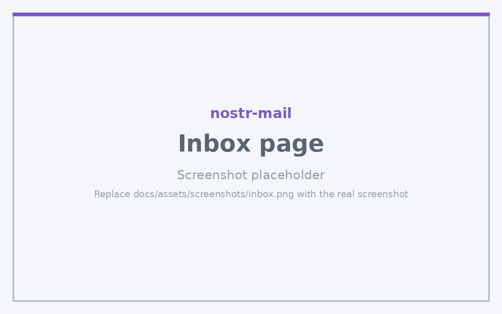

# Inbox Page

The Inbox page displays all received emails, with filtering and decryption capabilities.

## Purpose

View, search, and decrypt received emails from your IMAP server.

## Key Features

- **Email List**: View all emails with sender, subject, and preview
- **Email Details**: Full email viewing with decrypted content
- **Search**: Search emails by sender email address
- **Filtering**: Filter to show only Nostr-encrypted emails or all emails
- **Decryption**: Automatic decryption of encrypted emails using your private key
- **Pagination**: Load emails in pages (configurable page size)
- **Threading**: Related emails are grouped into conversation threads
- **Signature Verification**: Verify Nostr signatures on received emails

## Usage Instructions

### 1. View Inbox

- Navigate to Inbox tab
- Emails are automatically loaded from your IMAP server
- Click on any email to view details

### 2. Search Emails

- Use the search box to filter by sender email address
- Results update as you type

### 3. View Email Details

- Click on an email in the list
- View full email content with decrypted body
- See encryption status and signature verification

### 4. Refresh Inbox

- Click "Refresh" button to fetch new emails from server

### 5. View Threads

- Emails that belong to the same conversation are grouped into a thread, using the standard `In-Reply-To` and `References` headers
- Open a thread to see every message in the conversation in order

### 6. Navigate Back

- Click "Back to Inbox" to return to the email list

## Configuration Options

- **Email Filter**: Choose "Nostr Emails Only" or "All Emails" in Settings → Advanced → Inbox Filter
- **Inbox Folders**: Choose which IMAP folders are scanned in Settings → Advanced → Inbox Folders (defaults to INBOX, `nostr-mail`, and Archive on non-Gmail providers)
- **Spam Rescue / Auto-file**: Settings → Advanced → Email Preferences can pull Nostr mail out of Spam and consolidate it into the `nostr-mail` folder so it reliably surfaces here
- **Hide Undecryptable**: Enable in Settings → Advanced → Hide Undecryptable Emails
- **Require Signatures**: Enable in Settings → Advanced → Require Signatures
- **Hide Unverified**: Enable in Settings → Advanced → Hide Unverified
- **Emails Per Page**: Configure in Settings → Advanced → Emails Per Page (default: 50)

## Tips and Best Practices

- Use "Nostr Emails Only" filter to focus on encrypted communications
- Enable signature verification to ensure email authenticity
- Undecryptable emails are hidden by default (can be shown by disabling the setting)
- Refresh regularly to stay up-to-date with new emails
- Use search to quickly find emails from specific senders
